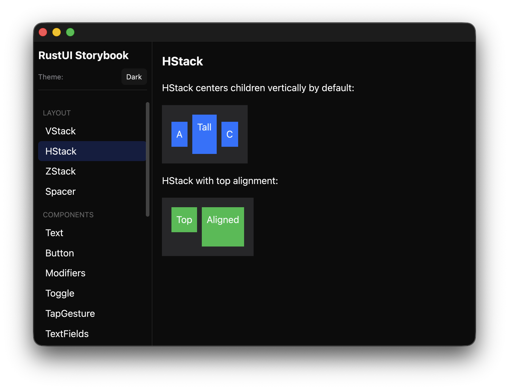
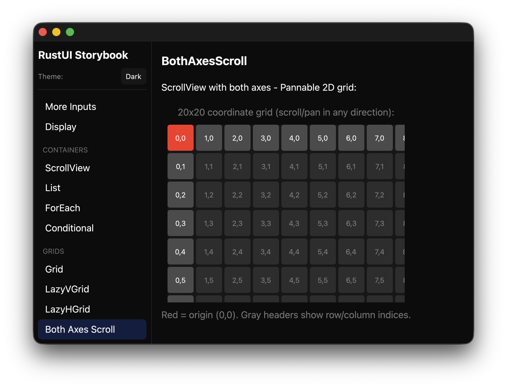

# Allui (read as: [Alloy](https://en.wikipedia.org/wiki/Alloy))

A SwiftUI-inspired UI framework for Rust, built on [GPUI](https://gpui.rs) and [gpui-component](https://longbridge.github.io/gpui-component/).

Allui brings SwiftUI's declarative, composable API to Rust desktop applications. If you know SwiftUI, you already know Allui. If you know Jetpack Compose, it’s close enough.

## Why Allui?

**The Problem**: Building desktop UIs in Rust typically means either low-level graphics programming or fighting with paradigms that don't fit the language. SwiftUI proved that declarative UI can be both powerful and ergonomic, but it's locked to Apple platforms.

**The Solution**: Allui provides SwiftUI's mental model and API patterns on top of GPUI (Zed editor's GPU-accelerated UI framework). You get:

- **Familiar patterns** - VStack, HStack, ZStack, modifiers, and component composition work like SwiftUI
- **True modifier semantics** - `.padding().background()` differs from `.background().padding()`, just like SwiftUI
- **Native performance** - GPU-accelerated rendering via GPUI
- **Cross-platform** - Runs wherever GPUI runs (macOS, Linux, Windows)

## Architecture

```
┌─────────────────────────────────────────────────────────────┐
│                       Your Application                      │
├─────────────────────────────────────────────────────────────┤
│                          Allui                              │
│  ┌─────────────────────┐  ┌────────────────────────────┐    │
│  │   Layout Primitives │  │        Components          │    │
│  │  ─────────────────  │  │   ────────────────────     │    │
│  │  VStack, HStack     │  │  Text, Button, Toggle      │    │
│  │  ZStack, Spacer     │  │  TextField, Slider         │    │
│  │  ScrollView, List   │  │  Picker, ProgressView      │    │
│  │  LazyVStack/HStack  │  │  Image, Label, Link        │    │
│  │  Grid, LazyVGrid    │  │                            │    │
│  │  LazyHGrid          │  │                            │    │
│  └─────────────────────┘  └────────────────────────────┘    │
│  ┌─────────────────────┐  ┌────────────────────────────┐    │
│  │   Modifier System   │  │      Control Flow          │    │
│  │  ─────────────────  │  │   ────────────────────     │    │
│  │  padding, frame     │  │   ForEach, If, IfLet       │    │
│  │  background, border │  │   Section, GridRow         │    │
│  │  corner_radius      │  │   GridItem                 │    │
│  │  shadow, opacity    │  │                            │    │
│  └─────────────────────┘  └────────────────────────────┘    │
├─────────────────────────────────────────────────────────────┤
│                      gpui-component                         │
│            (Stateful widgets: Switch, Input, etc.)          │
├─────────────────────────────────────────────────────────────┤
│                           GPUI                              │
│              (GPU-accelerated rendering engine)             │
└─────────────────────────────────────────────────────────────┘
```

## Quick Start

Add Allui to your `Cargo.toml`:

```toml
[dependencies]
allui = "0.1"
gpui = "0.2"
gpui-component = "0.5"
```

Create a simple view:

```rust
use gpui::{prelude::*, App, Context, Window};
use allui::prelude::*;

struct CounterView {
    count: i32,
}

impl Render for CounterView {
    fn render(&mut self, _window: &mut Window, cx: &mut Context<Self>) -> impl IntoElement {
        let count = self.count;

        VStack::new()
            .spacing(16.0)
            .child(
                Text::new(format!("Count: {}", count))
                    .font(Font::title())
            )
            .child(
                HStack::new()
                    .spacing(12.0)
                    .child(
                        Button::new("-", cx.listener(|this, _, _, _| {
                            this.count -= 1;
                        }))
                        .button_style(ButtonStyle::Bordered)
                    )
                    .child(
                        Button::new("+", cx.listener(|this, _, _, _| {
                            this.count += 1;
                        }))
                        .button_style(ButtonStyle::BorderedProminent)
                    )
            )
            .padding(24.0)
            .background(Color::secondary_system_background())
            .corner_radius(12.0)
    }
}
```

## Core Concepts

### Layout Stacks

Allui uses the same stack-based layout system as SwiftUI:

```rust
// Vertical stack - centers horizontally by default
VStack::new()
    .spacing(8.0)
    .alignment(HorizontalAlignment::Leading)
    .child(Text::new("Title"))
    .child(Text::new("Subtitle"))

// Horizontal stack - centers vertically by default
HStack::new()
    .spacing(12.0)
    .child(Image::system_name("star"))
    .child(Text::new("Favorites"))
    .child(Spacer::new())
    .child(Text::new("12"))

// Overlay stack - centers in both axes
ZStack::new()
    .child(background_image)
    .child(overlay_text)
```

### Modifier Chain

Modifiers wrap views in container elements. **Order matters**:

```rust
// Padding INSIDE the background (blue box with internal padding)
Text::new("Hello")
    .padding(16.0)
    .background(Color::blue())

// Padding OUTSIDE the background (blue box with external spacing)
Text::new("Hello")
    .background(Color::blue())
    .padding(16.0)
```

Available modifiers:

| Category | Modifiers |
|----------|-----------|
| Layout | `padding`, `frame`, `frame_size`, `frame_width`, `frame_height`, `fixed_size`, `aspect_ratio` |
| Visual | `background`, `foreground_color`, `corner_radius`, `border`, `shadow`, `opacity` |
| Behavior | `hidden`, `disabled`, `on_tap_gesture` |

### Scrolling & Lists

```rust
// Basic scroll view
ScrollView::new("my-scroll")
    .axes(ScrollAxes::vertical())
    .child(
        VStack::new()
            .children(items.iter().map(|item| ItemRow::new(item)))
    )

// iOS-style grouped list
List::new("settings")
    .list_style(ListStyle::inset_grouped())
    .child(
        Section::new()
            .header("Account")
            .child(Text::new("Profile"))
            .child(Text::new("Privacy"))
    )
    .child(
        Section::new()
            .header("General")
            .child(Text::new("Notifications"))
    )
```

### Control Flow

```rust
// Iterate over collections
VStack::new()
    .children(ForEach::new(&items, |item| {
        Text::new(item.name.clone())
    }))

// Conditional rendering
If::new(is_logged_in)
    .then(|| ProfileView::new())
    .otherwise(|| LoginView::new())

// Optional content
IfLet::new(selected_user, |user| {
    Text::new(format!("Hello, {}!", user.name))
})
```

### Virtualized Lists

For large datasets, use lazy stacks that only render visible items:

```rust
impl Render for MyListView {
    fn render(&mut self, _window: &mut Window, cx: &mut Context<Self>) -> impl IntoElement {
        LazyVStack::new(cx.entity().clone(), "item-list", &self.scroll_handle)
            .item_count(self.items.len())
            .item_height(44.0)
            .render_item(|view, index, _, _| {
                Text::new(&view.items[index])
                    .padding(12.0)
            })
            .build(_window, cx)
    }
}
```

### Grid Layouts

Allui provides both static and lazy grid layouts:

```rust
// Static Grid - auto-sizing columns based on content
Grid::new()
    .horizontal_spacing(16.0)
    .vertical_spacing(8.0)
    .child(
        GridRow::new()
            .child(Text::new("Name"))
            .child(Text::new("Value"))
    )
    .child(
        GridRow::new()
            .child(Text::new("Width"))
            .child(Text::new("100px"))
    )

// LazyVGrid - vertically-scrolling grid with fixed columns
let columns = vec![
    GridItem::flexible(),
    GridItem::flexible(),
    GridItem::fixed(100.0),
];

LazyVGrid::new(cx.entity().clone(), “photo-grid", &self.scroll_handle)
    .columns(columns)
    .spacing(8.0)
    .item_count(photos.len())
    .render_item(|view, index, _, _| {
        PhotoCell::new(&view.photos[index])
    })
    .build(window, cx)

// LazyHGrid - horizontally-scrolling grid with fixed rows
let rows = vec![GridItem::fixed(80.0), GridItem::fixed(80.0)];

LazyHGrid::new(cx.entity().clone(), “category-grid", &self.scroll_handle)
    .rows(rows)
    .spacing(12.0)
    .item_count(items.len())
    .render_item(|view, index, _, _| {
        CategoryCard::new(&view.items[index])
    })
    .build(window, cx)
```

## Components

### Display Components

| Component | Description |
|-----------|-------------|
| `Text` | Styled text with font and color options |
| `Label` | Icon + text combination |
| `Image` | Display images from files, URLs, or system icons |
| `Divider` | Visual separator line |
| `ProgressView` | Spinner or progress bar |
| `Link` | Tappable text that triggers actions |

### Input Components

| Component | Description |
|-----------|-------------|
| `Button` | Tappable button with multiple styles |
| `Toggle` | Boolean switch |
| `TextField` | Single-line text input |
| `SecureField` | Password input (masked) |
| `TextEditor` | Multi-line text input |
| `Slider` | Range value selection |
| `Stepper` | Increment/decrement control |
| `Picker` | Selection from options |

### Layout Components

| Component | Description |
|-----------|-------------|
| `VStack` | Vertical stack layout |
| `HStack` | Horizontal stack layout |
| `ZStack` | Overlay/layered layout |
| `Spacer` | Flexible space |
| `ScrollView` | Scrollable container (vertical, horizontal, or both) |
| `List` | iOS-style sectioned list |
| `Grid` | Static 2D table layout with auto-sizing columns |
| `LazyVStack` | Virtualized vertical list |
| `LazyHStack` | Virtualized horizontal list |
| `LazyVGrid` | Virtualized vertical grid with fixed columns |
| `LazyHGrid` | Virtualized horizontal grid with fixed rows |

## Examples

Run the interactive storybook to see all components:

```bash
cargo run --example storybook
```

<p align="center">
  
  
</p>

## Important Notes

### Initialization

Before using any gpui-component widgets (Toggle, TextField, etc.), initialize:

```rust
fn main() {
    Application::new().run(|cx: &mut App| {
        gpui_component::init(cx);  // Required!
        // ... rest of your app
    });
}
```

### State Management

Allui components are presentational. State lives in your GPUI view:

```rust
struct MyView {
    toggle_value: bool,
}

impl Render for MyView {
    fn render(&mut self, _window: &mut Window, cx: &mut Context<Self>) -> impl IntoElement {
        Toggle::new_with_handler(
            "Enable Feature",
            self.toggle_value,
            cx.listener(|this, checked: &bool, _, cx| {
                this.toggle_value = *checked;
                cx.notify();  // Trigger re-render
            })
        )
    }
}
```

## License

MIT License - see [LICENSE.md](LICENSE.d) for details.
